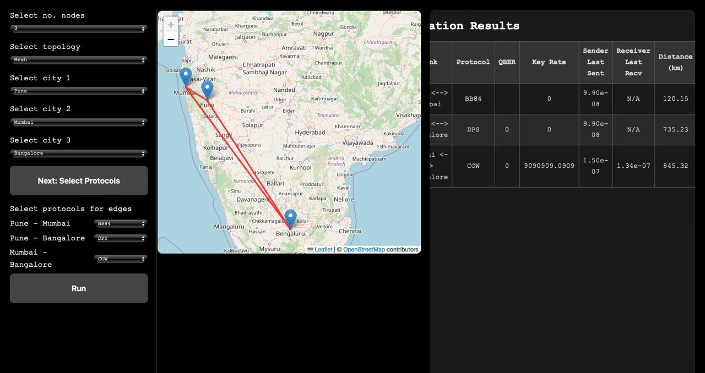

# Usage Guide

This simulator allows users to explore quantum key distribution (QKD) protocols in a configurable network environment. The system is designed to be interactive and intuitive, with visual feedback at each step.

## Node Selection

Users can select up to **6 nodes** to include in the QKD network. Each node corresponds to a city in India.

- Cities are displayed on an interactive map of India.
- Clicking on a city adds it to the network.
- The simulator calculates distances between selected cities to model realistic fiber-optic transmission losses.

## Topology Selection

After selecting the nodes, users can choose a network topology to define how the nodes are connected. Available topologies include:

- **Star**  
  A central node connected to all others.

- **Mesh**  
  All nodes are directly connected to each other.

- **Ring**  
  Each node is connected to two others, forming a closed loop.
Each edge (i.e., connection between two nodes) can be assigned a QKD protocol to simulate. Supported protocols include:

- **BB84**
- **COW**
- **DPS**

The selected protocol will determine how key bits are generated and transmitted between nodes.

## Simulation and Output

Once nodes, topology, and protocols are selected, the simulator runs a complete QKD session over the network. Output metrics are displayed in real time on the page, including:

- **QBER** (Quantum Bit Error Rate)
- **Key rate**
- **Sender's last sent bits**
- **Receiver's last received bits**

